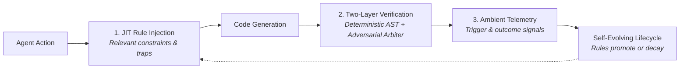

# Soma

[](LICENSE)
[](#-core-rules)
[](#-agent-skills)
[](#-core-architecture)
[](docs/project/CHANGELOG.md)
[](#)
[](https://dev.to/nseney1/your-ai-agents-rules-file-is-a-gentlemans-agreement-heres-what-happens-when-you-build-2dml)
[](https://m8ven.ai/mcp/nseney1/soma-governance?s=readme)

**Production-grade governance framework making AI coding agents trustworthy through observable, self-evolving constraints.**

Soma replaces static, unverified prompt rules (`.cursorrules`, `CLAUDE.md`) with a closed-loop governance engine: JIT context injection, deterministic AST verification, and Wilson-bounded rule evolution. Rules prove their value or decay to zero.



---

## 📖 Documentation Portal & Guides

Explore deep-dive guides for production architecture, workflows, and specifications:

| Guide | Description | Key Focus |
|:------|:------------|:----------|
| [**MCP Gateway**](docs/guides/mcp_gateway.md) | Dual-Plane Gateway Architecture | Control vs Execution Plane, receipt security, opt-in projection |
| [**Verification Pipeline**](docs/guides/verification_pipeline.md) | Two-Layer Verification Engine | Layer 1 AST checks, Layer 2 Adversarial Rebuttal, Gate 4.5 |
| [**Cell Lifecycle**](docs/guides/cell_lifecycle.md) | Evolutionary Rule Management | 5 cell types, Wilson scoring, promotion/demotion, zero-touch decay |
| [**Skill Graph**](docs/guides/skill_graph.md) | Horizontal Agent Collaboration | 15 organs, typed envelopes (<150 tokens), file-buffered handoffs |
| [**Compatibility**](docs/project/COMPATIBILITY.md) | SemVer 2.0 Guarantee | Formal backwards compatibility contracts starting at v1.0.0 |
| [**Security Policy**](SECURITY.md) | Vulnerability Reporting & Scopes | Security tiering, isolation, and responsible disclosure |

---

## Quick Start

```bash
pip install soma-governance    # Pure Python (3.9+), zero runtime dependencies
soma init --yes                # Auto-detects Gemini, Claude Code, Cursor, Copilot
soma status                    # View active rules and fitness stats
soma verify --layer1-only      # Run Layer 1 deterministic AST checks
```

### MCP Server (Recommended)

Add Soma to your agent's configuration (`SOMA_WORKSPACE` points to your project):
```json
{
  "mcpServers": {
    "soma": {
      "command": "python3",
      "args": ["-m", "soma_mcp"],
      "env": {
        "SOMA_WORKSPACE": "/path/to/project",
        "SOMA_EXECUTION_ENABLED": "1"
      }
    }
  }
}
```

| Tier | Available tools |
|:-----|:----------------|
| Read (default) | `soma_request_receipt`, `soma_scan`, `soma_list_cells`, `soma_grade`, `soma_coverage`, `soma_fitness`, `soma_audit_security`, `soma_audit_performance`, `soma_poll_verification`, `soma_list_rules`, `soma_rule_fitness` |
| Write (default; receipt required) | `soma_report_outcome`, `soma_capture_insight`, `soma_create_cell`, `soma_create_rule`, `soma_handoff` |
| Execute (opt-in; receipt required) | `soma_propose_change`, `soma_verify_changes`, `soma_checkpoint`, `soma_generate_manifest` |

*Receipt flow*: Call `soma_request_receipt` with the operation and arguments to obtain a single-use, state-bound token (300s TTL). See [MCP Gateway Guide](docs/guides/mcp_gateway.md).

### SDK

```python
from soma_sdk import Governance

gov = Governance(project_root='.')
print(gov.grade(), gov.fitness_landscape(bayesian=True))
```

---

## 📐 Core Rules

The system's foundational rules — 19 inherited behavioral defaults:

| Rule | Trigger | Purpose |
|:-----|:--------|:--------|
| [providence](genome/providence.md) | always_on | Codebase grounding, no hallucinations, diagnose-before-repair |
| [cost-optimization](genome/cost-optimization.md) | always_on | Token efficiency, diffs-only edits, FPSR metric (>80%) |
| [subagent-delegation](genome/subagent-delegation.md) | always_on | Context protection, concurrency limits, delegation floor |
| [architectural-tenets](genome/.oracles/architectural-tenets.md) | model_decision | Pragmatism, trade-off analysis, scale-to-zero |
| [atomic-workstream-protocol](genome/.oracles/atomic-workstream-protocol.md) | model_decision | Atomic 2-5 file micro-step decomposition and verification gates |
| [polyglot-standards](genome/.oracles/polyglot-standards.md) | model_decision | Unified entrypoints (Makefiles), containerization |
| [feature-specs](genome/.oracles/feature-specs.md) | model_decision | PRD structure, acceptance criteria, documentation |
| [testing](genome/.oracles/testing.md) | model_decision | Behavioral testing, sad paths, ast.parse ban |
| [documentation](genome/.oracles/documentation.md) | model_decision | ADRs, actionable READMEs, Mermaid diagrams |
| [destructive-ops](genome/destructive-ops.md) | model_decision | Dry-run mandates for IaC, database mutations, bulk git |
| [git-workflow](genome/.oracles/git-workflow.md) | model_decision | Conventional commits, .gitignore verification |
| [desktop-automation](genome/desktop-automation.md) | model_decision | PyAutoGUI/xdotool safety, focus verification |
| [core-change-protocol](genome/core-change-protocol.md) | model_decision | Approval gates for genome/enzyme modifications |
| [tdd-protocol](genome/.oracles/tdd-protocol.md) | model_decision | Test-driven development with sequential phase gates |
| [optional-import-guard](genome/.oracles/optional-import-guard.md) | model_decision | try/except guards on optional dependencies |
| [hgt-resource-consolidation](genome/hgt-resource-consolidation-hgt.md) | model_decision | Cross-project rule sharing governance |
| [ci-green-before-release](genome/ci-green-before-release.md) | model_decision | Requires green CI before release or deployment |
| [gitflow-review-gate](genome/gitflow-review-gate.md) | model_decision | Enforces reviewed Gitflow branch transitions |
| [no-pre-existing-excuse](genome/no-pre-existing-excuse.md) | model_decision | Requires fixing relevant pre-existing failures instead of dismissing them |

---

## 🔧 Agent Skills

15 specialized skills coordinate complex behaviors via typed envelopes and file-buffered handoffs. See the [Skill Graph Guide](docs/guides/skill_graph.md) for schemas and coordination workflows.

| Skills | Description |
|:-------|:------------|
| `adaptive-reviewer`, `staff-review`, `spec-synthesizer` | Multi-lens adversarial review and actionable plan synthesis |
| `security-audit`, `performance-audit`, `governance-auditor` | Specialized audits for AppSec (OWASP), latency/GC, and invariant compliance |
| `genesis`, `incident-debug`, `post-mortem` | Codebase reconnaissance, systematic incident debugging, blameless post-mortems |
| `refactoring-pilot`, `readme-writer`, `visual-analyst` | Mikado Method refactoring, documentation generation, UI/screen analysis |
| `session-monitor`, `session-preflight`, `domain-researcher` | Real-time waste tracking, environment pre-flight probes, external research |

---

## 📋 Adaptive Rules & Verification

Adaptive rules live in `.soma/cells/` (`wall`, `membrane`, `vacuole`, `chloroplast`, `plasmodesma`). Rules evolve using Wilson-bounded fitness intervals and decay to zero when unreinforced. See the [Cell Lifecycle Guide](docs/guides/cell_lifecycle.md).

All changes are gated by `soma verify`:
- **Layer 1**: Deterministic AST analysis (call graph reachability, mutation testing, import guards, branch coverage).
- **Layer 2**: Adversarial Rebuttal Protocol with Spec Agent prosecution, Code Agent defense, and binding Arbiter verdict (`SHIP` / `REVISE` / `BLOCK`). See the [Verification Pipeline Guide](docs/guides/verification_pipeline.md).

---

## ⚙️ Core Architecture

- **Zero Runtime Dependencies**: Pure Python standard library (`dependencies = []`).
- **Scale-to-Zero**: Zero daemons, zero background threads, zero persistent idle consumption.
- **Local Privacy**: Telemetry and evidence remain strictly local in `.soma/evidence/`.
- Complete script, tool, and module reference catalog is available in [SCRIPTS.md](docs/architecture/scripts.md).

---

## License & Privacy

Apache 2.0 — Copyright 2026 Nicholas Seney. See [NOTICE](NOTICE), [PRIVACY.md](PRIVACY.md), and [SECURITY.md](SECURITY.md).
