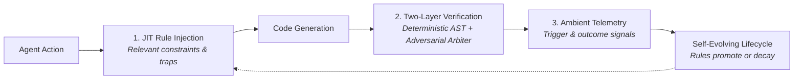

# Soma

[](LICENSE)
[](#-core-rules)
[](#-agent-skills)
[](#-architecture)
[](docs/project/CHANGELOG.md)
[](#)
[](https://dev.to/nseney1/your-ai-agents-rules-file-is-a-gentlemans-agreement-heres-what-happens-when-you-build-2dml)
[](https://m8ven.ai/mcp/nseney1/soma-governance?s=readme)

**Governance framework that makes AI coding agents trustworthy.**

Soma makes AI agents trustworthy by providing observably traceable governance — evidence-based rule selection, AST analysis tools, and adaptive rule lifecycle management. Rules that stop proving themselves expire. Rules that keep proving themselves get promoted. Claims that don't match evidence are caught.

> **The Problem**: Ungoverned AI coding agents waste significant portions of tokens in circular rework loops, hallucinated API calls, and broken assumptions. Static rule files (`.cursorrules`, `CLAUDE.md`) help but never adapt, and the agent can simply ignore them.
>
> **The Solution**: Soma provides JIT context injection, adaptive rule lifecycle, and pre-commit enforcement hooks to reduce waste. Rules are scored by Wilson-bounded fitness intervals and pruned when they stop proving value.

> **Internal naming convention**: Soma uses a biological metaphor internally (genome, organs, cells) to model rule evolution — see the codebase for details.

See the [NOTICE](NOTICE) and [PRIVACY.md](PRIVACY.md) files for our full Data Privacy Statement.

---

## How It Works

Soma replaces static, unverified prompt rules (`.cursorrules`, `CLAUDE.md`) with a closed-loop governance engine that injects constraints just-in-time, verifies generated code, and evolves rules based on evidence.



### 1. Just-In-Time (JIT) Context Injection
Static rule files waste context tokens and suffer from instruction dilution. Soma intercepts agent tool calls (via MCP or CLI) and injects **only the rules, architectural invariants, and known traps** that match the specific files the agent is currently reading or editing. Agents stay within their context budget while seeing the exact constraints that matter.

### 2. Two-Layer Verification Gate (`soma verify`)
Before changes are merged or committed, Soma runs an automated two-layer verification suite:
* **Layer 1: Deterministic AST Analysis (Zero API Keys)**  
  Fast, local Python Abstract Syntax Tree tools check call graph completeness, test uncovered branches, identify dead code, detect surviving mutations, and ensure import safety.
* **Layer 2: Adversarial Rebuttal Protocol (Optional LLM)**  
  An information-partitioned verification harness where a **Spec Agent** predicts hidden failure modes from the task plan, a **Code Agent** mounts a defense backed by real code and test execution evidence, and an **Arbiter** renders a binding `SHIP` or `BLOCK` verdict.

### 3. Zero-Touch Evolutionary Lifecycle
Rules in Soma are not permanent assumptions—they must mathematically prove their value:
* **Ambient Evidence**: Verification outcomes and historical git commits automatically mint fitness signals (`.soma/evidence/signals.jsonl`).
* **Wilson-Bounded Scoring**: Rules that consistently prevent defects without raising false alarms earn promotion from *candidate* to *invariant* to *core*.
* **Scale-to-Zero Decay**: Unobserved or obsolete rules decay and expire on read without requiring background daemons, cron jobs, or network calls.

### Security & Zero-Dependency Architecture
* **Zero Runtime Dependencies**: The core framework runs purely on Python standard library modules (`dependencies = []`). No third-party packages are required to install, run the CLI, enforce pre-commit checks, or operate the MCP server—eliminating supply chain vulnerabilities and dependency conflicts.
* **100% Local Privacy**: All rule files, evidence logs (`.soma/evidence/`), and telemetry remain strictly on your local filesystem. Zero telemetry or telemetry data is ever sent to external cloud backends.
* **Scale-to-Zero Footprint**: Zero background daemons, zero recurring cron jobs, and zero persistent listening threads. Soma runs purely on-demand when invoked by git hooks, agent tool calls, or CLI commands, consuming 0% CPU and memory when idle.
* **Command Safety & MCP Isolation**: Destructive commands (`rm -rf`, shell flag obfuscation) are intercepted by AST-level command inspection, and the MCP server enforces fail-closed session token authorization to block unauthorized tool access.

---

## Quick Start

### Install

```bash
# Clone
git clone https://github.com/nseney1/Soma-Governance.git && cd Soma-Governance

# Install the CLI (Python 3.9+)
pip install -e .

# Or install from PyPI
pip install soma-governance

# Set up governance (auto-detects Gemini, Claude Code, Cursor, or Copilot)
soma init --yes

# See what's active
soma status
```

> **`soma: command not found`** (common under zsh after `pip install --user`)? Run `python3 -m soma_cli doctor` for the exact `PATH` line for your shell, or see [QUICKSTART.md](QUICKSTART.md#soma-command-not-found).

<details>
<summary>Alternative install methods</summary>

```bash
# Global install via Makefile (Gemini / Antigravity)
make install

# Install rules for specific platforms
soma install --platform gemini     # Google Gemini
soma install --platform copilot    # GitHub Copilot
soma install --platform claude     # Claude Code
soma install --platform kiro       # AWS Kiro
soma install --platform mcp        # Any MCP-compatible agent
```

</details>

### MCP Server (Recommended)

Add Soma as an MCP server in your AI agent's config. Set `SOMA_WORKSPACE` to the governed project (the directory containing `.soma/`). No API key is needed because the host agent supplies the model.

```json
{
  "mcpServers": {
    "soma": {
      "command": "python3",
      "args": ["-m", "soma_mcp"],
      "env": {
        "SOMA_WORKSPACE": "/path/to/your/project",
        "SOMA_EXECUTION_ENABLED": "1"
      }
    }
  }
}
```

Works with Gemini Antigravity, Claude Code, Cursor, and any MCP-compatible agent.

**Capabilities:** With `SOMA_EXECUTION_ENABLED` omitted, the server exposes eleven read tools and four write tools. Write tools are discoverable but require a receipt. Setting `SOMA_EXECUTION_ENABLED=1` additionally exposes four execute tools, which also require receipts.

| Tier | Available tools |
|:-----|:----------------|
| Read (default) | `soma_request_receipt`, `soma_scan`, `soma_list_cells`, `soma_grade`, `soma_coverage`, `soma_fitness`, `soma_audit_security`, `soma_audit_performance`, `soma_poll_verification`, `soma_list_rules`, `soma_rule_fitness` |
| Write (default; receipt required) | `soma_report_outcome`, `soma_capture_insight`, `soma_create_cell`, `soma_create_rule` |
| Execute (opt-in; receipt required) | `soma_propose_change`, `soma_verify_changes`, `soma_checkpoint`, `soma_generate_manifest` |

**Receipt flow for write and execute tools:**

1. Call `soma_request_receipt` with the intended tool name in `operation` and the exact tool arguments in `arguments`. For `soma_report_outcome`, those arguments must include a non-empty, retry-stable `idempotency_key`.
2. Call that tool with the same arguments plus the returned `receipt`.

Receipts expire after 300 seconds and are single-use. They are bound to the current MCP session, canonical workspace, operation, exact arguments, target-file state, and governance rule state. If a target file or any active rule changes before redemption, request a new receipt. Receipts authorize a specific state-bound operation; they do not authenticate a person. Reusing the same `soma_report_outcome` idempotency key with the same payload is a no-op; changing the payload for that key fails closed.

**Asynchronous verification:** For long-running adversarial Layer 2 checks, `soma_verify_changes` accepts `async_mode: true`. The tool immediately returns a `job_token`, executing verification in a background worker thread. Host agents can poll job status and retrieve signed receipts via the read-only `soma_poll_verification` tool without blocking.

### SDK

```bash
pip install soma-governance
```

```python
from soma_sdk import Governance

gov = Governance(project_root='.')
landscape = gov.fitness_landscape(bayesian=True)
coverage = gov.coverage_report()
grade = gov.grade()
gov.signal('wall-gae-truncation', 'tp', metric={'survival_day': 12})
```

---

## CLI Commands

All governance workflows are available via the `soma` CLI:

| Command | Description |
|:--------|:------------|
| `soma init` | Set up governance for Gemini, Claude Code, Cursor, Copilot, or Kiro |
| `soma genesis` | Scan codebase architecture, generate adaptive governance rules |
| `soma status` | Show active rules and fitness stats |
| `soma report` | Session report card with compliance metrics |
| `soma doctor` | System health check — verifies installation integrity |
| `soma verify` | Layer 1 AST analysis on changed files (`--layer1-only` available) |
| `soma checkpoint` | Quality checks (`--pre-commit` for git hooks) |
| `soma hook` | Native lifecycle hooks (`pre-commit`, `safety-gate`, `pre-invocation`, `session-close`) |
| `soma sync` | Reconcile evidence JSONL with rule frontmatter (`--dry-run`, `--json`) |
| `soma oracle` | Rule health classification — healthy, noisy, expired, unobserved |
| `soma harvest` | Bootstrap cell fitness from git history (`--git`, `--limit`, `--dry-run`, `--json`) |
| `soma promote` | Evaluate rules for promotion (candidate → invariant → core). `--force --cell <id>` for manual |
| `soma demote` | Evaluate rules for demotion (high FP rate or dormant). `--force --cell <id>` for manual |

```bash
# Quick quality check before committing
soma checkpoint

# AST analysis (Layer 1)
soma verify

# Rule health dashboard
soma oracle --json

# See what rules earned promotion
soma promote --dry-run
```

---

## Architecture

Soma models governance as a layered system of rules, skills, and automation. Every component maps to a specific role:

```text
┌──────────────────────────────────────────────────────────────────────┐
│  📐 CORE RULES (genome/)          18 Rules — inherited defaults      │
│  🔧 AGENT SKILLS (organs/)       15 Skills — complex behaviors       │
│  ⚙️  CORE & CLI (soma_core/, soma_cli/) Pure Python Governance & CLI  │
├──────────────────────────────────────────────────────────────────────┤
│  🛡️ VERIFICATION                  AST analysis tools                  │
│     Layer 1: AST-based checks (import guards, complexity, coverage)  │
├──────────────────────────────────────────────────────────────────────┤
│  📋 ADAPTIVE RULES (.soma/cells/) → Per-Repo Governance             │
│     Vacuoles · Chloroplasts · Walls · Membranes · Plasmodesmata      │
└──────────────────────────────────────────────────────────────────────┘
```

| Layer | Directory | What It Contains |
|:------|:----------|:-----------------|
| **Core Rules** | `genome/` | 19 rules — inherited behavioral defaults, rarely changed. |
| **Agent Skills** | `organs/` | 15 skills — complex multi-step behaviors like adaptive-reviewer, genesis, security-audit. |
| **Core & CLI** | `soma_core/`, `soma_cli/` | Pure Python governance engine, cross-platform CLI, and evidence pipeline. |
| **Verification** | `soma_core/verification/` | Deterministic Layer 1 AST tools & Layer 2 adversarial rebuttal. |
| **Adaptive Rules** | `.soma/cells/` | Per-repo adaptive invariants. Generated, tested, evolved, or retired. |

---

## 🛡️ Two-Layer Verification Architecture

Soma eliminates "guess-and-check" coding loops and unverified agent completions by gating changes through two distinct, complementary verification layers before code is accepted:

```text
┌────────────────────────────────────────────────────────────────────────┐
│  LAYER 1: Deterministic Immune Tools (Fast, Offline, Pure Python AST)  │
│  ├── Call Graph Reachability    ├── Mutation Testing (Surviving Mutants)│
│  ├── Import & Boundary Guards   ├── Branch & Statement Coverage        │
│  └── Persistence Completeness                                          │
└───────────────────────────────────┬────────────────────────────────────┘
                                    │ (passes clean)
                                    ▼
┌────────────────────────────────────────────────────────────────────────┐
│  LAYER 2: Adversarial Rebuttal Protocol (Two-Phase Debate)             │
│                                                                        │
│   Task Plan ───►  [ Spec Agent ]  (Prosecution)                        │
│                         │                                              │
│                         ▼ Predicted Failure Modes                      │
│   Code + Tests ─► [ Code Agent ]  (Defense Rebuttal)                   │
│                         │                                              │
│                         ▼ Defended / Conceded Charges                  │
│                   [ Arbiter ]     (Impartial Adjudication)             │
│                         │                                              │
│                         ▼                                              │
│              ✅ SHIP  |  ⚠️ REVISE  |  🔴 BLOCK                         │
└────────────────────────────────────────────────────────────────────────┘
```

### Layer 1 — Deterministic Immune Tools (Zero LLM)
Fast, deterministic static analysis running purely via Python AST inspection and targeted test execution:
- **Call Graph Completeness**: Proves every defined function or method is reachable from at least one call site or public export (`__all__`).
- **Mutation Testing**: Injects AST mutations into modified code to verify tests fail for the right reasons.
- **Import & Boundary Guards**: Ensures modules respect architectural layers (e.g. core never imports server or CLI).
- **Branch Coverage**: Validates branch-level test execution across changed code paths.
- **Persistence Completeness**: Asserts state schemas match serialized storage fields.

### Layer 2 — Adversarial Rebuttal Protocol
When Layer 1 passes, Layer 2 executes a structured adversarial debate between two independent personas:
1. **Spec Agent (Prosecution)**: Evaluates the proposed plan and implementation to predict specific failure modes, unhandled edge cases, and architectural regressions.
2. **Code Agent (Defense)**: Receives the specific charges from the Spec Agent and must defend or concede each charge using concrete code references and test evidence.
3. **Arbiter**: Evaluates the evidence, divergences, and concessions to issue an authoritative verdict:
   - **`SHIP` (Exit 0)**: All charges defended with verified evidence; Layer 1 clean.
   - **`REVISE` (Exit 1)**: Actionable defects identified with clear fix instructions.
   - **`BLOCK` (Exit 1)**: Critical defects, regression risks, or unsubstantiated claims.

> [!NOTE]
> **Optional API Keys & Graceful Fallback**:
> Layer 2 requires an optional inference provider API key (`GEMINI_API_KEY`, `ANTHROPIC_API_KEY`, or `OPENAI_API_KEY`, resolved from environment variables or the system keyring via `keyring`).
> 
> **Zero-Breakage Fallback**: If no API key is configured or no `--plan` is supplied, Soma **gracefully falls back to Layer 1 deterministic checks alone**. The command passes cleanly (`exit 0`) if all Layer 1 AST checks succeed, ensuring offline developers, sandboxed environments, and CI/CD pipelines never fail due to missing keys. An interactive prompt-and-paste fallback (`--provider prompt`) is also supported for air-gapped terminal workflows.

Run it directly from the CLI:
```bash
# Deterministic checks only (offline / CI)
soma verify --layer1-only

# Full Two-Layer Verification
soma verify --files path/to/file.py --plan "Task description"
```

---

## 📐 Core Rules

The system's foundational rules — 19 rules that define inherited behavior. Always-on rules are loaded every session; conditional rules activate on demand.

| Rule | Trigger | Purpose |
|:-----|:--------|:--------|
| [providence](genome/providence.md) | always_on | Codebase grounding, no hallucinations, diagnose-before-repair |
| [cost-optimization](genome/cost-optimization.md) | always_on | Token efficiency, diffs-only edits, FPSR metric (>80%) |
| [subagent-delegation](genome/subagent-delegation.md) | always_on | Context protection, concurrency limits, delegation floor |
| [architectural-tenets](genome/.oracles/architectural-tenets.md) | model_decision | Pragmatism, trade-off analysis, scale-to-zero |
| [atomic-workstream-protocol](genome/.oracles/atomic-workstream-protocol.md) | model_decision | Atomic 2-5 file micro-step decomposition and verification gates |
| [polyglot-standards](genome/.oracles/polyglot-standards.md) | model_decision | Unified entrypoints (Makefiles), containerization |
| [feature-specs](genome/.oracles/feature-specs.md) | model_decision | PRD structure, acceptance criteria, documentation |
| [testing](genome/.oracles/testing.md) | model_decision | Behavioral testing, sad paths, ast.parse ban |
| [documentation](genome/.oracles/documentation.md) | model_decision | ADRs, actionable READMEs, Mermaid diagrams |
| [destructive-ops](genome/destructive-ops.md) | model_decision | Dry-run mandates for IaC, database mutations, bulk git |
| [git-workflow](genome/.oracles/git-workflow.md) | model_decision | Conventional commits, .gitignore verification |
| [desktop-automation](genome/desktop-automation.md) | model_decision | PyAutoGUI/xdotool safety, focus verification |
| [core-change-protocol](genome/core-change-protocol.md) | model_decision | Approval gates for genome/enzyme modifications |
| [tdd-protocol](genome/.oracles/tdd-protocol.md) | model_decision | Test-driven development with sequential phase gates |
| [optional-import-guard](genome/.oracles/optional-import-guard.md) | model_decision | try/except guards on optional dependencies |
| [hgt-resource-consolidation](genome/hgt-resource-consolidation-hgt.md) | model_decision | Cross-project rule sharing governance |
| [ci-green-before-release](genome/ci-green-before-release.md) | model_decision | Requires green CI before release or deployment |
| [gitflow-review-gate](genome/gitflow-review-gate.md) | model_decision | Enforces reviewed Gitflow branch transitions |
| [no-pre-existing-excuse](genome/no-pre-existing-excuse.md) | model_decision | Requires fixing relevant pre-existing failures instead of dismissing them |

---

## 🔧 Agent Skills

Complex multi-step behaviors — each skill performs a specialized function.

| Skill | Purpose |
|:------|:--------|
| [adaptive-reviewer](organs/adaptive-reviewer/SKILL.md) | Auto-escalating review orchestrator with subagent nesting |
| [domain-researcher](organs/domain-researcher/SKILL.md) | Compiles verified external facts (wikis, API docs) |
| [genesis](organs/genesis/SKILL.md) | Codebase onboarding: four-stage read-only reconnaissance |
| [governance-auditor](organs/governance-auditor/SKILL.md) | Mechanical per-rule PASS/FAIL compliance checks |
| [incident-debug](organs/incident-debug/SKILL.md) | SRE: reproduce → isolate → diagnose → fix → verify |
| [performance-audit](organs/performance-audit/SKILL.md) | Hot-path allocations, O(n²) patterns, GC pressure |
| [post-mortem](organs/post-mortem/SKILL.md) | Blameless retrospective analysis, pattern extraction |
| [readme-writer](organs/readme-writer/SKILL.md) | Scannable, copy-pasteable developer READMEs |
| [refactoring-pilot](organs/refactoring-pilot/SKILL.md) | Mikado Method, incremental moves across 4+ files |
| [security-audit](organs/security-audit/SKILL.md) | AppSec Engineer: OWASP Top 10, hardcoded secrets |
| [session-monitor](organs/session-monitor/SKILL.md) | Live waste trajectory tracking, periodic probes |
| [session-preflight](organs/session-preflight/SKILL.md) | Pre-flight: venv health, git state, test suite verification |
| [spec-synthesizer](organs/spec-synthesizer/SKILL.md) | Cross-references multi-lens findings into prioritized plans |
| [staff-review](organs/staff-review/SKILL.md) | Multi-lens fan-out (10 lenses) with staff-level synthesis |
| [visual-analyst](organs/visual-analyst/SKILL.md) | Screen & UI analysis: game state, regressions |

---

## 📋 Adaptive Rules

Adaptive rules are the per-repository governance layer — atomic, dynamically generated invariants that live exclusively inside your repository (`.soma/cells/`).

| Rule Type | Role | What It Does |
|:----------|:-----|:-------------|
| **Vacuole** | Anti-pattern trap | Catches known anti-patterns (e.g., "Don't use raw coordinates") |
| **Chloroplast** | Best-practice injector | Injects idiomatic patterns (e.g., "Use async FastAPI conventions") |
| **Cell Wall** | Non-negotiable boundary | Non-negotiable safety gate (e.g., "Never skip GAE truncation") |
| **Membrane** | Selective review trigger | Forces elevated review when sensitive areas change |
| **Plasmodesmata** | Cross-service contract | Governs data shapes and APIs between services |

### Rule Lifecycle

Adaptive rules operate on an evidence-based lifecycle:

```text
Generate → Score (Confidence Decay) → Adapt → Differentiate → Prune / Retire → Promote
   ↑                                                                               |
   └──────────────────────── External Fitness Signals (CI/CD, tests, metrics) ─────┘
```

**Lifecycle operators**: Differentiation (vacuoles harden into walls), Confidence Decay (confidence decays unless reinforced), Retirement (immediate eviction on excess false positives), Horizontal Transfer (cross-project sharing with probation), Version History (provenance tracking).

**Fitness scoring**: Wilson-bounded fitness scoring with credible intervals — rules are scored by true positive rate using Wilson score intervals for statistically rigorous confidence bounds. Laplace smoothing `(tp + 1) / (triggers + 2)` provides the point estimate; Wilson bounds determine promotion and pruning thresholds. The Python SDK and CLI use the canonical `parse_cell_file` parser; the dependency-light MCP path uses its documented standard-library frontmatter parser.

**Credit assignment**: Scope-narrowed credit assignment with per-file conservation — when multiple rules match the same changed file, each rule's fitness signal is weighted by `1/N` (where N = matching rules for that file). Fractional credit is stored deterministically rather than randomly rounded. Canonical events are recorded in `.soma/evidence/signals.jsonl` with credit and provenance metadata.

**Structured crossover**: Structured field-level rule merging — two high-fitness rules can be crossed to produce offspring with combined hypotheses, max impact weight, merged target paths (union), and reset fitness counters. Lineage tracking records parent IDs, generation number, and creation method.

**Tournament selection**: Tournament selection for rule competition — random k-sample selection identifies the highest-fitness rule per round. Read-only operation preserves rule state. Handles null fitness, oversized k, and empty rule directories gracefully.

**Tiered enforcement**: Rules earn their enforcement tier through demonstrated defect prevention — `advisory` (prompt injection) → `mechanical` (pre-commit block) → `gate` (CI block). Enforcement ladder evaluates rule invariants and applies tier-appropriate blocking.

**Quorum sensing**: Multi-rule consensus for high-confidence decisions — when ≥N rules trigger simultaneously on the same changed files, Soma detects a systemic issue and escalates the review mode to the highest `minimum_mode` among triggered rules. Quorum events are logged to JSONL for trend analysis.

**Gate enforcement DSL**: Rules can declare invariants in frontmatter (e.g., `import_banned`, `file_must_exist`) that are evaluated against changed files. Violations are enforced according to the rule's enforcement tier: advisory warns without blocking, gate exits non-zero in CI.

> **Planned features**: See [ROADMAP.md](docs/project/ROADMAP.md) for upcoming work.

---

## ⚙️ Core Architecture & Scripts

Soma is implemented as a pure-Python governance system with zero runtime dependencies. See [SCRIPTS.md](docs/architecture/scripts.md) for the complete reference catalog of CLI commands, verification scripts, SDK modules, and core engines.

---

## Configuration

Copy [`soma.conf.example`](install/soma.conf.example) → `soma.conf` to customize.

| Variable | Default | Description |
|:---------|:--------|:------------|
| `SOMA_PLATFORM` | `gemini` | Target AI platform: `gemini`, `kiro`, `copilot`, `claude`, `mcp` |
| `SOMA_INFERENCE_PROVIDER` | `auto` | LLM provider: `auto`, `gemini`, `anthropic`, `openai`, `prompt-only` |
| `DEFAULT_REVIEW_MODE` | `gale` | Session default review intensity |
| `CELL_TELOMERE_DAYS` | `30` | Days for fitness confidence to halve |
| `CELL_TELOMERE_WALL` | `null` | Walls (invariants) never decay |
| `TEAM_SIZE` | `solo` | Team topology: `solo`, `small`, `team`, `enterprise` |


### Cross-OS Support

| OS | Shell | Install | Uninstall | Core Rules | Agent Skills | Hooks |
|:---|:------|:--------|:----------|:----------:|:------------:|:-----:|
| **Linux** | Bash | `make install` or `soma install` | `make uninstall` or `soma uninstall` | ✅ | ✅ | ✅ |
| **macOS** | Zsh / Bash | `make install` or `soma install` | `make uninstall` or `soma uninstall` | ✅ | ✅ | ✅ |
| **WSL** | Bash | `make install` or `soma install` | `make uninstall` or `soma uninstall` | ✅ | ✅ | ✅ |
| **Windows (Git Bash)** | Bash | `make install` or `soma install` | `make uninstall` or `soma uninstall` | ✅ | ✅ | ✅ |
| **Windows (PowerShell)** | PowerShell | `soma install` | `soma uninstall` | ✅ | ✅ | ✅ |

> **Windows Support:** As of v0.93.0, Windows PowerShell 5.1, PowerShell 7, and Git Bash have full parity with native lifecycle hooks (`soma hook`) and UTF-8 encoding ([BUG-014](docs/project/BUG_REGISTRY.json), [BUG-032](docs/project/BUG_REGISTRY.json)). Details: [Known Issues — Windows](docs/KNOWN_ISSUES_WINDOWS.md).

---

## How Soma Differs

Soma replaces passive prompt files with active lifecycle-managed governance: JIT context loading prevents bloat, adaptive rules trap repo-specific bugs, and AST analysis catches violations deterministically.

For design analysis, see [ABSTRACT.md](docs/research/abstract.md).

---

## Testing & CI

### Test Suite

```bash
make test       # Full validation + pytest
make validate   # Shell syntax, Python compilation, JSON templates
make doctor     # System health check
```

See [CONTRIBUTING.md](docs/project/CONTRIBUTING.md) for test guidelines and execution instructions.

### CI/CD Pipeline

GitHub Actions runs on `ubuntu-latest`, `macos-latest`, and `windows-latest`:
- **Linux/macOS**: Shell syntax validation → Python compilation → pytest → hardcoded path audit → script count invariant (≥16) → privacy audit → dry-run install sweep (all 5 platforms) → claim registry verification
- **Windows**: PowerShell AST parsing → dry-run install with rule count assertion

### Documentation Gating

Every feature claim in this README is tracked in [`docs/project/CLAIM_REGISTRY.json`](docs/project/CLAIM_REGISTRY.json). A claim can only appear in README when:
1. Its behavioral test suite exists and passes
2. It has a Claim Registry entry with status `unlocked`
3. The CI gate (`soma_core.enforcement`) confirms no regressions

Features that are planned but not yet shipped are listed in [ROADMAP.md](docs/project/ROADMAP.md).

---

## Documentation

| Document | Audience | Description |
|:---------|:---------|:------------|
| [**Blog Post**](https://dev.to/nseney1/your-ai-agents-rules-file-is-a-gentlemans-agreement-heres-what-happens-when-you-build-2dml) | Everyone | "Your AI agent's rules file is a gentleman's agreement..." |
| [PRIVACY.md](PRIVACY.md) | Users | Data privacy boundaries and LLM opt-in details |
| [CHANGELOG](docs/project/CHANGELOG.md) | Users | Release history |
| [Bug Registry](docs/project/BUG_REGISTRY.json) | Contributors, agents | Every known bug, fixed and open, with root cause and regression test |
| [Known Issues — Windows](docs/KNOWN_ISSUES_WINDOWS.md) | Windows users | Open Windows bugs, workarounds, and impact |
| [SECURITY](SECURITY.md) | Security researchers | Supported versions, private vulnerability reporting, scope |
| [ROADMAP](docs/project/ROADMAP.md) | Users | Planned features and their tracking status |
| [PHYLOGENY](docs/architecture/phylogeny.md) | Contributors | Phase-by-phase evolutionary narrative |
| [MECHANISM_DESIGN](docs/architecture/mechanism_design.md) | Contributors | Formal mechanism design mapping |
| [SCRIPTS](docs/architecture/scripts.md) | Contributors | Full automation script catalog |
| [METRICS](docs/project/METRICS.md) | Users | Empirical measurement methodology |
| [ABSTRACT](docs/research/abstract.md) | Researchers | Research paper abstract |
| [CONTRIBUTING](docs/project/CONTRIBUTING.md) | Contributors | Contribution guidelines |

## Uninstalling

Remove installed governance rules and configuration across platforms:

```bash
soma uninstall                    # Remove Soma files for active platform
soma uninstall --platform gemini  # Target a specific platform (gemini, kiro, copilot, claude, mcp)
soma uninstall --dry-run          # Preview what would be removed without deleting
soma uninstall --local            # Remove from project-local directory
```

Or via Makefile:

```bash
make uninstall                    # Uses SOMA_PLATFORM from soma.conf or default (gemini)
```

## License

Apache 2.0 — Copyright 2026 Nicholas Seney
See [NOTICE](NOTICE) for Data Privacy details.
