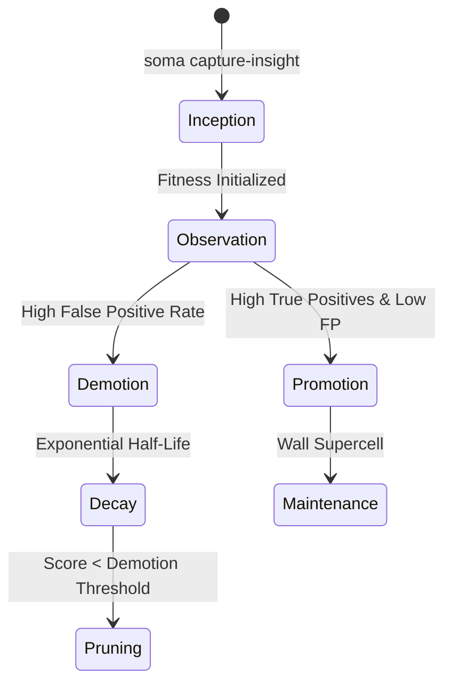

# Cell Lifecycle & Biological Rule Engine

> Evolutionary, self-healing governance rules that adapt, promote, decay, and prune based on empirical evidence.

---

## 1. Cell Anatomy & Types

Soma rules are called **Cells** (`.soma/cells/`). Every cell is stored as a Markdown document with strongly typed YAML frontmatter parsed by the zero-dependency `SomaYAML` parser:

| Cell Type | Directory | Enforcement | Role |
| :--- | :--- | :--- | :--- |
| **Wall** | `walls/` | `gate` | Hard architectural and security invariants; failures block pre-commit and CI. |
| **Membrane** | `membranes/` | `advisory` | Interface boundary and contract guards; monitors cross-module communications. |
| **Vacuole** | `vacuoles/` | `advisory` | Traps, historical anti-patterns, and flashlight-effect detectors. |
| **Chloroplast** | `chloroplasts/` | `advisory` | Agent personas, specialized capabilities, and generative prompt lenses. |
| **Plasmodesmata** | `plasmodesmata/` | `advisory` | Channel bridges linking tool suites, CLI commands, and MCP endpoints. |

---

## 2. The Evolutionary Lifecycle

Cells evolve biologically over time through five distinct phases:

1. **Inception**: Created via `soma capture-insight` or MCP `soma_capture_insight` following an incident or review.
2. **Observation**: Monitored by the outcome reflection engine as agents work.
3. **Promotion**: Cells with high true positive rates and low false positives are promoted toward hard Wall status.
4. **Decay**: Inactive or ineffective advisory cells undergo exponential decay (`decay: true`).
5. **Pruning**: Cells that drop below their demotion threshold are automatically pruned to prevent context bloat.

---

## 3. Bayesian Fitness Scoring

Soma uses Bayesian Wilson score confidence intervals to calculate cell fitness without bias:
- **Wilson Lower Bound**: Penalizes small sample sizes; requires empirical evidence before asserting high fitness.
- **Credit Assignment**: Attributed proportional credit across files modified in a session.
- **Threshold Recalibration**: Dynamic adjustment based on project velocity and historical defect heat zones.
