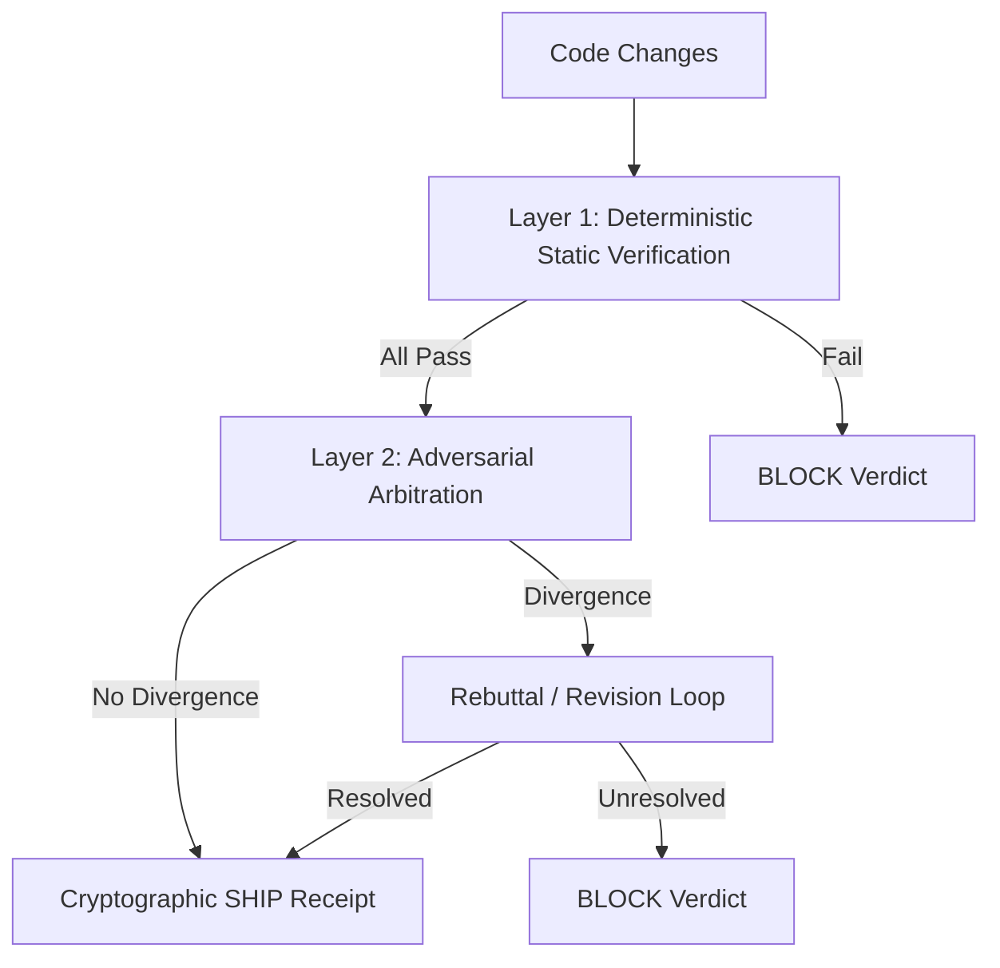

# Verification Pipeline & Release Gates

> Dual-layer closed-loop verification combining deterministic static checks and adversarial arbitration.

---

## 1. Pipeline Architecture

The Soma verification engine (`soma verify`) operates as a closed loop protecting repository integrity across two sequential evaluation layers:



---

## 2. Layer 1: Deterministic Static Verification

Layer 1 executes in < 3 seconds on local development machines and does not require an LLM or network access:

1. **Call Graph Completeness (`call_graph`)**:
   Traverses Python AST to verify that every defined function is reachable from internal call sites, public exports (`__all__`), or CLI entrypoints.
2. **Import Guards (`import_guard`)**:
   Enforces that third-party packages are guarded with `try/except` or `pytest.importorskip` unless explicitly declared in `pyproject.toml`.
3. **Mutation Testing (`mutation_tester`)**:
   Injects AST mutations (operator inversions, boolean flips, return value replacements) and asserts that the corresponding test suite kills all mutants.
4. **Branch Coverage (`branch_coverage`)**:
   Ensures modified branches have execution paths verified by behavioral tests.
5. **Persistence Completeness (`persistence_checker`)**:
   Checks serialization contracts and field round-trips for telemetry and outcomes.

---

## 3. Layer 2: Adversarial Arbitration & Receipts

Layer 2 evaluates semantic intent and behavioral contracts using independent Spec and Review lenses:

- **Stateful Turn-2 Rebuttals**: If charges are surfaced, defending agents can provide focused rebuttals (`soma verify --rebuttal "..."`). The arbiter re-evaluates the original charge sheet with anti-poisoning HMAC validation.
- **Cryptographic Tree Hash Binding**:
  Every SHIP receipt in `.soma/evidence/arbitration_cycle_{N}.json` is bound to the exact Git commit tree (`git rev-parse HEAD^{tree}`).
- **Information Partitioning (SOMA-V01)**:
  Spec agent plans are scrubbed to prevent defending agents from cheating specification boundaries.

---

## 4. Release Gate 4.5

CI/CD and release workflows enforce Release Gate 4.5 via:
```bash
soma verify --release-gate
```
Gate 4.5 cryptographically asserts that:
1. The working tree is clean.
2. The latest arbitration cycle ended in a `SHIP` verdict.
3. The recorded receipt `tree_hash` matches current `HEAD^{tree}` (with allowable modifications strictly restricted to committing the evidence receipt).
4. All modified files against the base branch (`origin/main...HEAD`) are covered by the arbitration receipt.
